# 🤖 MT5 Trading Assistant

[](https://pypi.org/project/mt5-mcp/)
[](https://huggingface.co/spaces/MCP-1st-Birthday/mt5-mcp-ui)
[](https://huggingface.co/MCP-1st-Birthday)
[](LICENSE)

> **🏆 MCP's 1st Birthday Hackathon Submission** - Hosted by Anthropic and Gradio

AI-powered trading assistant that bridges LLMs to MetaTrader 5 via the Model Context Protocol (MCP). Built with Gradio 6 for real-time market analysis, technical indicators, and ML-based forecasting.

---

## 🎬 Demo Video

[](https://youtube.com)

*Demo video coming soon!*

---

## 🐦 Social Media

📢 [X/Twitter Announcement](#) | 💼 [LinkedIn Post](#)

## 👥 Team

- [@cloudmeru](https://huggingface.co/cloudmeru) - Developer

---

## 🚀 Features

| Feature | Description |
|---------|-------------|
| 💬 **Agentic Chat** | AI assistant with tool calling and thought visualization |
| 🔌 **MCP Server** | Expose MT5 tools to Claude Desktop, Cursor, VS Code Copilot |
| 📊 **80+ Indicators** | RSI, MACD, Bollinger Bands, ATR, SMA, EMA, and more |
| 🔮 **ML Forecasting** | Prophet time-series prediction + XGBoost trading signals |
| 📈 **Real-time Charts** | Interactive candlestick charts with indicator overlays |
| 🔒 **Read-Only** | Safe market analysis without trade execution |
| 🧪 **Demo Mode** | Launch with `--mode demo` to keep Settings tab read-only while still testing connections |
| 🌐 **Dual Mode** | Run locally with MT5, or connect to remote MCP server |

---

## 📖 How It Works


**Workflow:**
1. User asks about market analysis in chat
2. LLM agent decides which MT5 tools to use
3. Tools fetch real-time data from MetaTrader 5
4. Results visualized with charts and insights

---

## 🚀 Try It

### Example Prompts

```
"What's the current price of EURUSD?"
"Analyze BTCUSD with RSI and MACD indicators"
"Give me a 24-hour forecast for XAUUSD with chart"
"Show me technical analysis of gold (XAUUSD) on H4 timeframe"
```

---

## 🏗️ Architecture

MT5 MCP UI operates in two modes:

```mermaid
flowchart LR
  subgraph mode_selection[Mode Selection]
    direction LR
    app_mode["APP MODE<br/>(UI + MCP Client)<br/><br/>• Cloud deployment<br/>• HuggingFace Spaces<br/>• Linux/macOS<br/>• Connects to remote MCP"]
    mcp_mode["MCP MODE<br/>(Full Stack Server)<br/><br/>• Windows only<br/>• Local MT5 connection<br/>• Exposes MCP endpoint<br/>• Claude Desktop ready"]
  end
  classDef default fill:#0f172a,stroke:#94a3b8,color:#f8fafc;
  classDef mode_selection fill:#020617,stroke:#0f172a,color:#f8fafc;
```



### MCP Mode (Windows)

```mermaid
flowchart LR
  user([User]) --> ui[Gradio UI]
  ui --> local_mcp["Local mt5-mcp"]
  local_mcp --> mt5[MetaTrader 5]
  local_mcp --> endpoint["MCP Endpoint<br/>(Claude Desktop, etc.)<br/>• http://localhost:7860/gradio_api/mcp/sse"]
```



### App Mode (Any Platform)


---

## 🚀 Quick Start

### Option 1: HuggingFace Space (Easiest)

Visit the live demo: [**MT5 Trading Assistant**](https://huggingface.co/spaces/MCP-1st-Birthday/mt5-mcp-ui)

### Option 2: Local Windows Installation (Full Access or Demo)

```bash
# Requires Windows + MetaTrader 5 installed and logged in

# Install
pip install mt5-mcp-ui

# Run in development mode (default) for full configuration access
python -m mt5_mcp_ui --mode development

# Or launch the kiosk-style demo experience (Settings locked but tests work)
python -m mt5_mcp_ui --mode demo

# The app auto-detects Windows + mt5-mcp for tool execution
```

**MCP Endpoints (for Claude Desktop, etc.):**
- Streamable HTTP: `http://localhost:7860/gradio_api/mcp/`
- SSE: `http://localhost:7860/gradio_api/mcp/sse`

### Option 3: Remote MCP (Any Platform)

```bash
# Linux/macOS/Cloud - connects to remote MCP server

# Set environment variable
export MCP_URL=http://your-windows-server:7860/gradio_api/mcp/sse

# Run the UI in development mode (default) or demo/production as needed
python -m mt5_mcp_ui --mode development
```

### Option 4: From Source

```bash
git clone https://github.com/Cloudmeru/mt5-mcp-ui
cd mt5-mcp-ui
pip install -e .
python -m mt5_mcp_ui --help
```

---

## ⚙️ Configuration

### Environment Variables

Create a `.env` file:

```env
# Application Mode (optional override)
# Options: development, production, demo
APP_MODE=development
# Legacy flag still supported for production deployments
PRODUCTION_MODE=false

# MCP Server URL (used when acting as MCP client)
MCP_URL=http://localhost:7860/gradio_api/mcp/sse
MCP_TRANSPORT=streamable_http

# LLM Provider API Keys (set at least one)
OPENAI_API_KEY=sk-...
ANTHROPIC_API_KEY=sk-ant-...
GOOGLE_API_KEY=...
XAI_API_KEY=xai-...
GITHUB_TOKEN=ghp_...
OPENROUTER_API_KEY=sk-or-...

# Azure OpenAI
AZURE_OPENAI_API_KEY=...
AZURE_OPENAI_ENDPOINT=https://your-resource.openai.azure.com/

# Azure AI Foundry
AZURE_AI_API_KEY=...
AZURE_AI_ENDPOINT=https://your-resource.services.ai.azure.com/

# HuggingFace
HUGGINGFACE_API_KEY=hf_...

# Disable specific providers (comma-separated)
DISABLED_PROVIDERS=ollama,huggingface
```

### CLI Options

```bash
python -m mt5_mcp_ui --help

Options:
  --mode {development,production,demo}  UI behavior preset (default: environment)
  --port PORT       Server port (default: 7860)
  --host HOST       Host/IP to bind (default: 127.0.0.1)
  --share           Create public URL via Gradio
  --root-path PATH  Mount app behind a reverse-proxy subpath
```

### Demo Mode Behavior

`--mode demo` (or `APP_MODE=demo`) keeps the Settings tab visible but **read-only**. Users can still run the *Test MCP Connection* and *Test LLM Connection* buttons to verify infrastructure, yet configuration fields and the Save button stay disabled. A hidden textbox (`demo-mode-flag`) exposes a telemetry-free signal for embedding environments.

---

## 🔧 MCP Tools Available

When running in MCP mode, these tools are exposed at the MCP endpoint:

| Tool | Description | Example Query |
|------|-------------|---------------|
| `mt5_query` | Query symbol info, OHLC rates, account data | "Get EURUSD current price" |
| `mt5_analyze` | Technical analysis with 80+ indicators | "Show RSI and MACD for BTCUSD H1" |
| `execute_mt5` | Execute custom Python code against MT5 | "Get the last 100 candles" |

### Tool Features

- **80+ Technical Indicators**: RSI, MACD, Bollinger Bands, ATR, SMA, EMA, Stochastic, ADX, and more
- **Prophet Forecasting**: Time-series prediction with confidence intervals
- **XGBoost ML Signals**: AI-powered BUY/SELL/HOLD recommendations
- **Multi-Panel Charts**: Generated automatically with clickable file links

---

## 🔌 Claude Desktop Integration

Add to your Claude Desktop config (`claude_desktop_config.json`):

```json
{
  "mcpServers": {
    "mt5-trading": {
      "command": "python",
      "args": ["-m", "mt5_mcp_ui", "--mode", "mcp"],
      "env": {
        "PYTHONPATH": "."
      }
    }
  }
}
```

Or connect to a running server:

```json
{
  "mcpServers": {
    "mt5-trading": {
      "url": "http://localhost:7860/gradio_api/mcp/sse"
    }
  }
}
```

---

## 🤖 Supported LLM Providers

| Provider | Models | Notes |
|----------|--------|-------|
| **OpenAI** | GPT-4o, GPT-4o-mini, o1, o1-mini | Default |
| **Anthropic** | Claude 3.5 Sonnet, Claude 3 Opus | Excellent for analysis |
| **Google** | Gemini 2.5 Flash, Gemini 2.5 Pro | Fast |
| **Azure OpenAI** | GPT-4o deployments | Enterprise |
| **Azure AI Foundry** | Various models | Microsoft Foundry |
| **xAI** | Grok-3, Grok-3-mini | Alternative |
| **GitHub Models** | GPT-4o, Claude, etc. | Via GitHub |
| **OpenRouter** | 200+ models | Unified API |
| **Ollama** | Local models | Self-hosted |
| **HuggingFace** | Inference API models | Cloud inference |

---

## 📖 Documentation

- [**Architecture Guide**](ARCHITECTURE.md) - Detailed system design
- [**Deployment Guide**](docs/DEPLOYMENT_ARCHITECTURE.md) - Cloud, Docker, HuggingFace deployment

---

## 🏆 Hackathon Tracks

This project is submitted to both tracks:

### 🔧 Track 1: Building MCP
`building-mcp-track-consumer`
- Gradio 6 MCP server integration via `mcp_server=True`
- Dynamic tool discovery from mt5-mcp package
- Exposes 3 powerful trading analysis tools
- Works with Claude Desktop, Cursor, VS Code Copilot

### 🤖 Track 2: MCP in Action  
`mcp-in-action-track-consumer`
- Autonomous agent with planning and reasoning
- Tool calling with thought visualization
- Real-world trading analysis application
- 10+ LLM provider support

---

## 🛠️ Built With

- **[Gradio 6](https://gradio.app)** - UI Framework with native MCP server support
- **[mt5-mcp](https://pypi.org/project/mt5-mcp/)** - MetaTrader 5 MCP Server
- **[MCP Protocol](https://modelcontextprotocol.io)** - Model Context Protocol by Anthropic
- **[Prophet](https://facebook.github.io/prophet/)** - Time-series forecasting
- **[XGBoost](https://xgboost.readthedocs.io/)** - ML trading signals
- **[ta](https://github.com/bukosabino/ta)** - Technical Analysis library

---

## 📖 Documentation

- [**Complete Architecture Guide**](docs/ARCHITECTURE.md) - Detailed system design, deployment scenarios, and troubleshooting
- [**Contributing Guide**](CONTRIBUTING.md) - How to contribute to the project

---

## 🔗 Related Projects

| Resource | Link |
|----------|------|
| 🔧 **MT5 MCP Server** | [github.com/Cloudmeru/MetaTrader-5-MCP-Server](https://github.com/Cloudmeru/MetaTrader-5-MCP-Server) |
| 📦 **PyPI (mt5-mcp)** | [pypi.org/project/mt5-mcp](https://pypi.org/project/mt5-mcp/) |
| 🖥️ **PyPI (mt5-mcp-ui)** | [pypi.org/project/mt5-mcp-ui](https://pypi.org/project/mt5-mcp-ui/) |
| 📖 **MCP Protocol** | [modelcontextprotocol.io](https://modelcontextprotocol.io) |
| 🎓 **Gradio Docs** | [gradio.app](https://gradio.app) |

---

## ⚠️ Disclaimer

This is a **proof of concept** for educational and demonstration purposes only.

- ❌ Not financial advice
- ❌ Not suitable for actual trading decisions
- ✅ **Read-only access** - no trade execution capability
- ⚠️ Past performance does not indicate future results

Use at your own risk. Always consult with financial professionals before making trading decisions.

---

## 📝 License

MIT License - see [LICENSE](LICENSE) for details.

---

## 🙏 Acknowledgments

- **Anthropic** - For creating the MCP protocol and co-hosting the hackathon
- **Gradio Team** - For the amazing Gradio 6 with native MCP support
- **HuggingFace** - For hosting the hackathon and providing infrastructure
- **All Sponsors** - OpenAI, Google, Modal, ElevenLabs, and others

---

*Built with ❤️ for [MCP's 1st Birthday Hackathon](https://huggingface.co/MCP-1st-Birthday) - November 2025*
