# MT5-MCP-UI: Complete Architecture & Deployment Guide

> 🏆 **MCP's 1st Birthday Hackathon Submission** - Hosted by Anthropic and Gradio
> 
> **Competition:** [MCP-1st-Birthday](https://huggingface.co/MCP-1st-Birthday) | **Deadline:** November 30, 2025, 11:59 PM UTC

---

## Table of Contents

1. [Project Overview](#1-project-overview)
2. [Architecture Modes](#2-architecture-modes)
3. [UI Mode Selection](#3-ui-mode-selection)
4. [Repository Structure](#4-repository-structure)
5. [Core Components](#5-core-components)
6. [Deployment Scenarios](#6-deployment-scenarios)
7. [Environment Variables](#7-environment-variables)
8. [MCP Endpoints & Tools](#8-mcp-endpoints--tools)
9. [LLM Provider Support](#9-llm-provider-support)
10. [Deployment Guides](#10-deployment-guides)
11. [Security & Best Practices](#11-security--best-practices)
12. [Monitoring & Troubleshooting](#12-monitoring--troubleshooting)

---

## 1. Project Overview

**Name:** `mt5-mcp-ui`  
**Purpose:** AI-powered trading assistant that bridges LLMs to MetaTrader 5 via the MCP protocol, built with Gradio 6 for the MCP 1st Birthday Hackathon.

**Hackathon Tracks:**
- 🔧 **Track 1: Building MCP** - `building-mcp-track-consumer` (MCP server for retail traders)
- 🤖 **Track 2: MCP in Action** - `mcp-in-action-track-consumer` (Agentic trading assistant)

**Key Features:**
- 💬 Chat-based trading assistant UI (Gradio 6 Blocks + ChatInterface)
- 🔌 Native MCP Server integration (`mcp_server=True`)
- 🤖 Autonomous agent behavior with tool calling (planning, reasoning, execution)
- 📊 Real-time MT5 data visualization & technical analysis
- 🔮 Prophet forecasting + XGBoost ML signals display
- 🎯 80+ technical indicators via ta library
- 🔒 Read-only & safe (no trading execution)

---

## 2. Architecture Modes

MT5 MCP UI operates in two infrastructure topologies:

### 2.1 App Mode (Client Only)

UI-only mode that connects to a remote MCP server for MT5 data access.


**Use Cases:**
- ✅ UI accessible from anywhere
- ✅ Cloud deployment (HuggingFace Spaces, Docker)
- ✅ Linux/macOS development
- ✅ Scales to multiple users

### 2.2 MCP Mode (Full Stack)

Full MCP server that exposes MT5 tools via the MCP protocol.


**Use Cases:**
- ✅ Complete solution on a single machine
- ✅ No network configuration needed
- ✅ Ideal for personal trading/analysis
- ✅ Exposes MCP endpoint for Claude Desktop, Cursor, VS Code

### 2.3 Environment Detection Logic

```mermaid
flowchart TB
  start([Start]) --> space_id{"SPACE_ID env exists?"}
  space_id -->|Yes| huggingface_only["HuggingFace → App Mode Only"]
  space_id -->|No| platform_check["platform.system()"]
  platform_check --> windows{"Is Windows?"}
  windows -->|No| linux_app["Linux/macOS → App Mode Only"]
  windows -->|Yes| check_mt5["Check mt5-mcp availability"]
  check_mt5 --> mt5_installed{"mt5-mcp installed?"}
  mt5_installed -->|Yes| both_modes["Both modes available<br/>Default: MCP Mode"]
  mt5_installed -->|No| app_only_win["App Mode Only"]
```



---

## 3. UI Mode Selection

The UI supports three presentation modes that control the Settings tab behavior:

| Mode | CLI / Env | Behavior |
|------|-----------|----------|
| **Development** | `--mode development` / `APP_MODE=development` | Settings tab fully editable (default) |
| **Production** | `--mode production` / `PRODUCTION_MODE=true` | Settings tab hidden; environment variables only |
| **Demo** | `--mode demo` / `APP_MODE=demo` | Settings tab visible but read-only; Test buttons active |

### Mode Selection Logic

1. **Environment overrides** – `APP_MODE` env var wins. Legacy `PRODUCTION_MODE=true` still forces production.
2. **Default** – If no override is present, defaults to `development` for contributor-friendly experience.

### CLI Usage

```bash
# Development mode (editable settings - default)
python -m mt5_mcp_ui --mode development

# Production mode (hide settings entirely)
python -m mt5_mcp_ui --mode production

# Demo mode (show settings but lock inputs/save)
python -m mt5_mcp_ui --mode demo
```

**Note:** UI modes are independent from infrastructure topology (App vs MCP mode).

---

## 4. Repository Structure

```
mt5-mcp-ui/
├── .github/
│   ├── FUNDING.yml
│   ├── workflows/
│   │   └── ci.yml
│   └── ISSUE_TEMPLATE/
│       ├── bug_report.md
│       └── feature_request.md
├── docs/
│   └── ARCHITECTURE.md          # This file
├── src/
│   └── mt5_mcp_ui/
│       ├── __init__.py           # Package exports, version
│       ├── __main__.py           # CLI entry point
│       └── app.py                # Main Gradio application
├── .env.example                  # Environment template
├── .gitattributes                # Git line ending config
├── .gitignore                    # Git exclusions
├── .pylintrc                     # Linting config
├── CONTRIBUTING.md               # Contributor guide
├── HACKATHON_SUBMISSION.md       # Hackathon details
├── LICENSE                       # MIT License
├── PROMOTION.md                  # Marketing materials
├── pyproject.toml                # Project config
├── README.md                     # Main documentation
├── init-repo.ps1                 # Git init script (Windows)
└── init-repo.sh                  # Git init script (Unix)
```

---

## 5. Core Components

### 5.1 Main Application (`app.py`)

The core Gradio application with MCP integration.

**Key Functions:**
```python
def create_app() -> gr.Blocks:
    """Create the Gradio application with multimodal chat interface."""
    
def chat_with_tools(message: str, history: list) -> str:
    """Process chat message with MCP tool support."""
    
def get_llm_client(provider: str, ...) -> OpenAI:
    """Get LLM client for the specified provider."""
```

### 5.2 MCP Client (`MCPClient` class)

Handles connection to MCP servers (both SSE and Streamable HTTP).

```python
class MCPClient:
    """MCP client for tool discovery and execution."""
    
    async def list_tools(self) -> list[dict]:
        """Discover available tools from MCP server."""
        
    async def call_tool(self, name: str, arguments: dict) -> dict:
        """Call an MCP tool."""
```

### 5.3 Configuration (`Config` class)

Manages environment variables and settings.

```python
class Config:
    """Simple configuration class."""
    
    def __init__(self):
        self.mcp_url = os.getenv("MCP_URL") or os.getenv("MT5_MCP_URL")
        self.mcp_transport = os.getenv("MCP_TRANSPORT", "sse")
        self.llm_provider = os.getenv("LLM_PROVIDER", "openai")
        # ... more settings
```

---

## 6. Deployment Scenarios

### 6.1 Local Windows (MCP Mode)

**Complete solution on a single machine.**

```bash
# Requirements: Windows + MT5 installed and logged in
pip install mt5-mcp-ui

# Run with default settings
python -m mt5_mcp_ui

# Run in production mode (hides settings)
python -m mt5_mcp_ui --mode production
```

**MCP Endpoints:**
- SSE: `http://localhost:7860/gradio_api/mcp/sse`
- Streamable HTTP: `http://localhost:7860/gradio_api/mcp/`

### 6.2 Split Deployment (App + MCP Server)

**UI on cloud/remote machine, MT5 on Windows.**

**Windows Server Setup:**
```bash
# On Windows with MT5
python -m mt5_mcp_ui --mode production --host 0.0.0.0 --port 7860
```

**Remote Client Setup:**
```bash
# On cloud/Linux/macOS
export MCP_URL=http://windows-server:7860/gradio_api/mcp/sse
python -m mt5_mcp_ui --mode development
```

### 6.3 HuggingFace Spaces

**Public demo deployment.**

**Step 1:** Create Space at huggingface.co/spaces

**Step 2:** Configure secrets:
- `MCP_URL` or `MT5_MCP_URL` = your MCP server URL
- `MCP_TRANSPORT` = `sse` or `streamable_http`
- `OPENAI_API_KEY` (or other LLM provider key)
- `PRODUCTION_MODE` = `true` (hides settings)

**Step 3:** Push code with proper entry point:

```python
# app.py (root level)
from mt5_mcp_ui import create_app

demo = create_app()
demo.launch()
```

### 6.4 Docker Deployment

**Dockerfile:**
```dockerfile
FROM python:3.11-slim

WORKDIR /app
COPY . .
RUN pip install -e .

EXPOSE 7860

# App mode for Docker (no MT5)
ENV MT5_APP_MODE=app

CMD ["python", "-m", "mt5_mcp_ui", "--mode", "production", "--host", "0.0.0.0"]
```

**Docker Compose:**
```yaml
version: '3.8'

services:
  mt5-ui:
    image: mt5-mcp-ui
    build: .
    ports:
      - "7860:7860"
    environment:
      - MCP_URL=http://windows-host:7860/gradio_api/mcp/sse
      - OPENAI_API_KEY=${OPENAI_API_KEY}
      - PRODUCTION_MODE=true
    restart: unless-stopped
```

---

## 7. Environment Variables

### Core Configuration

```env
# Application Mode
APP_MODE=development              # development | production | demo
PRODUCTION_MODE=false             # Legacy toggle (true forces production)

# MCP Connection
MCP_URL=http://localhost:7860/gradio_api/mcp/sse
MCP_TRANSPORT=sse                 # 'sse' or 'streamable_http'

# Gradio Server
GRADIO_SERVER_PORT=7860
GRADIO_SERVER_NAME=0.0.0.0
GRADIO_SHARE=false
```

### LLM Providers

```env
# OpenAI
OPENAI_API_KEY=sk-...
LLM_PROVIDER=openai
LLM_MODEL=gpt-4o-mini

# Anthropic
ANTHROPIC_API_KEY=sk-ant-...

# Google
GOOGLE_API_KEY=...

# Azure OpenAI
AZURE_OPENAI_API_KEY=...
AZURE_OPENAI_ENDPOINT=https://your-resource.openai.azure.com/
AZURE_OPENAI_DEPLOYMENT=gpt-4o

# Azure AI Foundry
AZURE_AI_API_KEY=...
AZURE_AI_ENDPOINT=https://your-resource.services.ai.azure.com/
AZURE_AI_DEPLOYMENT=DeepSeek-R1-0528

# xAI
XAI_API_KEY=xai-...

# GitHub Models
GITHUB_TOKEN=ghp_...

# OpenRouter
OPENROUTER_API_KEY=sk-or-...

# Ollama (local)
OLLAMA_BASE_URL=http://localhost:11434/v1

# HuggingFace
HUGGINGFACE_API_KEY=hf_...

# Disable providers (set to 'disabled')
OPENAI_API_KEY=disabled           # Hides OpenAI from UI
```

---

## 8. MCP Endpoints & Tools

### Endpoints (MCP Mode Only)

| Endpoint | Protocol | Description |
|----------|----------|-------------|
| `/gradio_api/mcp/sse` | SSE | Server-Sent Events transport (default) |
| `/gradio_api/mcp/` | Streamable HTTP | Streamable HTTP transport |

### Available Tools

When running in MCP mode, these tools are exposed:

| Tool | Description | Example Query |
|------|-------------|---------------|
| **mt5_query** | Query symbol info, OHLC rates, account data | "Get EURUSD current price" |
| **mt5_analyze** | Technical analysis with 80+ indicators | "Show RSI and MACD for BTCUSD H1" |
| **execute_mt5** | Execute custom Python code against MT5 | "Get the last 100 candles" |

### Tool Features

- **80+ Technical Indicators**: RSI, MACD, Bollinger Bands, ATR, SMA, EMA, Stochastic, ADX, etc.
- **Prophet Forecasting**: Time-series prediction with confidence intervals
- **XGBoost ML Signals**: AI-powered BUY/SELL/HOLD recommendations with confidence scores
- **Multi-Panel Charts**: Automatically generated with clickable file links

### Claude Desktop Integration

Add to `claude_desktop_config.json`:

```json
{
  "mcpServers": {
    "mt5-trading": {
      "command": "python",
      "args": ["-m", "mt5_mcp_ui", "--mode", "mcp"],
      "env": {
        "PYTHONPATH": "."
      }
    }
  }
}
```

Or connect to running server:

```json
{
  "mcpServers": {
    "mt5-trading": {
      "url": "http://localhost:7860/gradio_api/mcp/sse"
    }
  }
}
```

---

## 9. LLM Provider Support

| Provider | Models | Env Variable | Notes |
|----------|--------|--------------|-------|
| **OpenAI** | GPT-4o, GPT-4o-mini, o1, o1-mini | `OPENAI_API_KEY` | Default provider |
| **Anthropic** | Claude 3.5 Sonnet, Claude 3 Opus | `ANTHROPIC_API_KEY` | Excellent for analysis |
| **Google** | Gemini 2.5 Flash, Gemini 2.5 Pro | `GOOGLE_API_KEY` | Fast responses |
| **Azure OpenAI** | GPT-4o deployments | `AZURE_OPENAI_API_KEY` | Enterprise grade |
| **Azure AI Foundry** | DeepSeek, Phi, Mistral | `AZURE_AI_API_KEY` | Microsoft Foundry |
| **xAI** | Grok-3, Grok-3-mini | `XAI_API_KEY` | Alternative option |
| **GitHub Models** | GPT-4o, Claude, etc. | `GITHUB_TOKEN` | Via GitHub |
| **OpenRouter** | 200+ models | `OPENROUTER_API_KEY` | Unified API |
| **Ollama** | Local models | (no key) | Self-hosted |
| **HuggingFace** | Inference API | `HUGGINGFACE_API_KEY` | Cloud inference |

---

## 10. Deployment Guides

### 10.1 Reverse Proxy Configuration

#### Nginx Example

```nginx
server {
    listen 80;
    server_name myapp.example.com;

    location / {
        proxy_pass http://127.0.0.1:7860;
        proxy_http_version 1.1;
        proxy_set_header Upgrade $http_upgrade;
        proxy_set_header Connection "upgrade";
        proxy_set_header Host $host;
        proxy_set_header X-Real-IP $remote_addr;
        proxy_set_header X-Forwarded-For $proxy_add_x_forwarded_for;
        proxy_set_header X-Forwarded-Proto $scheme;
        
        # SSE support
        proxy_buffering off;
        proxy_cache off;
    }
}
```

#### Subpath Deployment

```bash
# Run with root-path for subpath deployment
python -m mt5_mcp_ui --root-path /chat --port 7860 --host 0.0.0.0
```

```nginx
location /chat/ {
    proxy_pass http://127.0.0.1:7860/;
    # ... same proxy settings as above
}
```

### 10.2 Network Exposure Options

| Scenario | Command | Access URL |
|----------|---------|------------|
| **Local Only** | `python -m mt5_mcp_ui` | `http://localhost:7860` |
| **LAN Access** | `python -m mt5_mcp_ui --host 0.0.0.0` | `http://192.168.x.x:7860` |
| **Public Link** | `python -m mt5_mcp_ui --share` | `https://xxxxx.gradio.live` |
| **Custom Port** | `python -m mt5_mcp_ui --port 8080` | `http://localhost:8080` |
| **Behind Proxy** | `python -m mt5_mcp_ui --root-path /chat` | `https://example.com/chat` |

### 10.3 Resource Requirements

```mermaid
flowchart LR
  mcp_resources["MCP Mode (Windows + MT5)<br/>• CPU: 2+ cores<br/>• RAM: ≥4GB (MT5 ≈1GB)<br/>• Disk: 2GB for MT5 + 500MB app<br/>• Network: Low latency"]
  app_resources["App Mode (Cloud/Remote)<br/>• CPU: 1 core<br/>• RAM: ≥1GB<br/>• Disk: 200MB<br/>• Network: Stable link to MCP server"]
  mcp_resources --- app_resources
```



---

## 11. Security & Best Practices

### 11.1 Network Security

```mermaid
flowchart TB
  network_layer["Layer 1: Network<br/>• Use VPN for remote MCP access<br/>• Restrict ports with firewalls<br/>• Enforce HTTPS/TLS"]
  auth_layer["Layer 2: Authentication<br/>• Enable Gradio auth<br/>• Store API keys in env vars<br/>• Keep .env files out of Git"]
  account_layer["Layer 3: MT5 Account<br/>• Use demo accounts for testing<br/>• Prefer read-only mode<br/>• Monitor account activity"]
  network_layer --> auth_layer --> account_layer
```



### 11.2 API Key Management

**❌ DON'T:**
```env
# Never commit API keys to Git
OPENAI_API_KEY=sk-actual-key-here
```

**✅ DO:**
```env
# Use .env file (gitignored)
OPENAI_API_KEY=sk-actual-key-here

# Or export environment variables
export OPENAI_API_KEY=sk-actual-key-here
```

### 11.3 Production Checklist

- [ ] Set `PRODUCTION_MODE=true` or `APP_MODE=production`
- [ ] Use environment variables for all secrets
- [ ] Enable HTTPS/TLS for external access
- [ ] Configure firewall rules
- [ ] Use demo MT5 accounts for testing
- [ ] Enable Gradio authentication if needed
- [ ] Monitor logs for suspicious activity
- [ ] Keep dependencies updated
- [ ] Regular backups of configuration

---

## 12. Monitoring & Troubleshooting

### 12.1 Common Issues

| Issue | Cause | Solution |
|-------|-------|----------|
| "MCP mode not available" | Running on Linux/macOS or mt5-mcp not installed | Use app mode with remote MCP server |
| "Cannot connect to MT5" | MT5 terminal not running | Start MT5 and login |
| "MCP connection failed" | Wrong URL or server not running | Check `MCP_URL` and server status |
| "No API key" | Missing LLM provider key | Set appropriate API key in .env |
| "Rate limit exceeded" | Too many LLM API calls | Wait and retry, or use different provider |
| "Tool call failed" | Invalid parameters or MT5 issue | Check tool arguments and MT5 connection |

### 12.2 Diagnostic Commands

```bash
# Check Python environment
python --version
pip list | grep "mt5-mcp\|gradio\|openai"

# Test MCP connection (App mode)
python -c "
from mt5_mcp_ui.app import MCPClient
import asyncio
client = MCPClient('http://localhost:7860/gradio_api/mcp/sse')
asyncio.run(client.list_tools())
"

# Verify mt5-mcp installation (MCP mode)
python -c "import mt5_mcp; print(mt5_mcp.__version__)"

# Check environment variables
python -c "
from mt5_mcp_ui.app import get_config
config = get_config()
print(f'MCP URL: {config.mcp_url}')
print(f'LLM Provider: {config.llm_provider}')
print(f'LLM Model: {config.llm_model}')
"
```

### 12.3 Enable Debug Logging

```bash
# Run with verbose output
python -m mt5_mcp_ui --mode development

# Check Gradio logs in UI
# Look for MCP connection status and tool execution logs
```

### 12.4 Performance Optimization

**Recommended Settings by Use Case:**

| Use Case | Mode | Hardware | Notes |
|----------|------|----------|-------|
| **Personal Trading** | MCP | Any Windows PC | Default settings work well |
| **Team Demo** | App + MCP | Cloud + Windows Server | Consider `--share` for easy access |
| **Production** | Split | Dedicated servers | Use reverse proxy with HTTPS |
| **HuggingFace** | App | Free tier | Add MCP server URL in secrets |

---

## Summary

### Mode Comparison

| Scenario | App Mode | MCP Mode | MT5 Location |
|----------|----------|----------|--------------|
| **Local Windows** | ❌ | ✅ | Local |
| **Cloud/HuggingFace** | ✅ | ❌ | Remote Windows |
| **Split Deployment** | ✅ (cloud) | ✅ (Windows) | Windows server |
| **Demo/Testing** | Either | Either | As needed |

### Key Takeaways

- **MCP Mode**: Full integration, Windows required, MT5 local, exposes MCP endpoint
- **App Mode**: UI only, any platform, connects to remote MCP server
- **UI Modes**: Control settings visibility (development/production/demo)
- **Flexible Deployment**: Local, cloud, Docker, HuggingFace Spaces
- **Multi-Provider**: Support for 10+ LLM providers
- **Secure**: Environment-based configuration, no hardcoded secrets

---

*For more information, see [README.md](../README.md) and [CONTRIBUTING.md](../CONTRIBUTING.md)*
